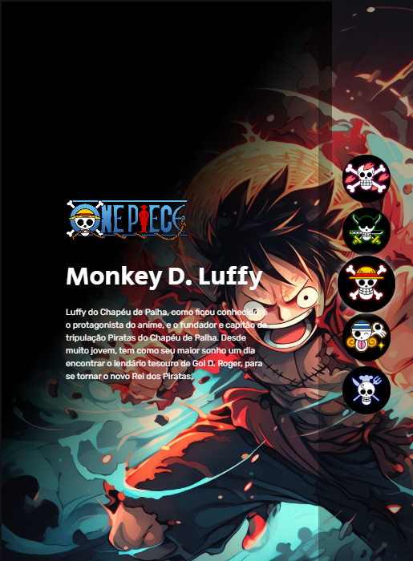

# One Piece Character Selector

  

## Desing: 
* 

## Descrição

  

   Este é um projeto que permite aos usuários selecionar personagens do anime One Piece e exibir suas fotos e descrições na tela. É 
   uma aplicação web que utiliza HTML, CSS e JavaScript para alcançar esse objetivo. atualmente hospedado no 
    <a href="https://gabrielduartep.github.io/projeto-one-piece/">GitHub-Pages</a>.
  

## Funcionalidades
Lista de seleção de personagens do One Piece.
Exibição da foto e descrição do personagem selecionado.
Design responsivo para se adaptar a diferentes tamanhos de tela.

## Tecnologias utilizadas:

 * HTML
 * CSS
 * JAVASCRIPT

 ### Pra entrar em contato, veja as redes abaixo!
 

 
  
  
   

